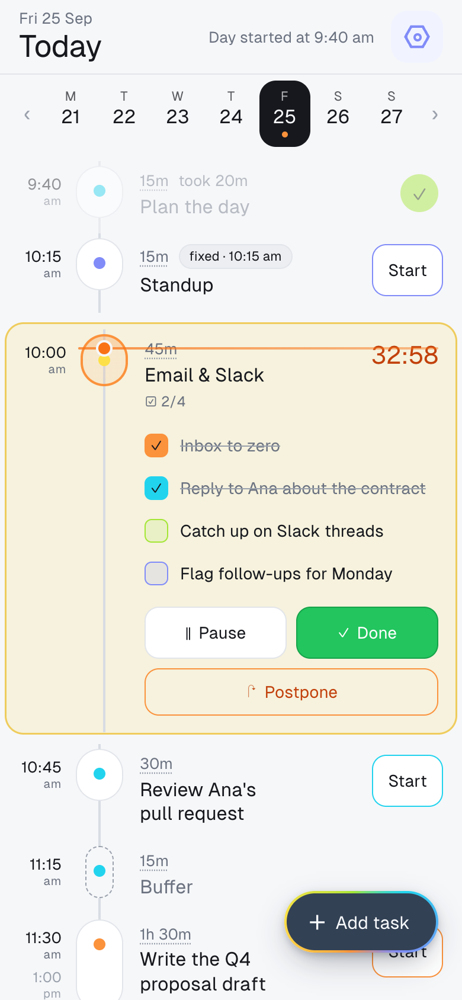
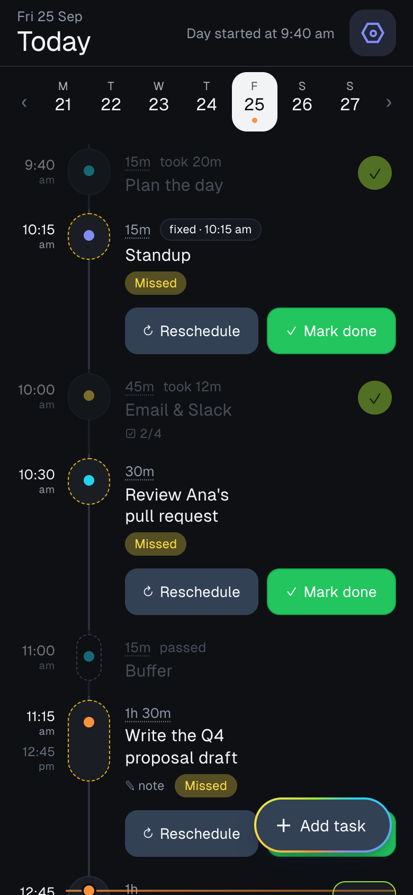

# Elastic Day

A planner for one day at a time, where **the order of the list is the plan**.

You add what you want to do and roughly how long it takes. You never type a start or end time: they're worked out from the order of the list, from anything pinned to a fixed time, and from what actually happened. Run a task long, pause it, push it to later, and the rest of the day moves to fit.

Live at **[kaiserkhan.com/planner](https://kaiserkhan.com/planner/)**. It works on a phone or a desktop, in light or dark, installs like an app, and keeps working offline.

<p>
  
  
</p>

## How it works

- **Your day, your hours.** On a first visit, two questions shape the plan: when your day usually starts (or that it varies) and how long a productive day is for you. With a start that varies, the day's length counts from when you press _Start my day_. Change either in Settings → _Your day_.
- **Tasks, buffers and fixed times.** A task has a duration: pick a preset or set your own hours and minutes. A buffer is slack you can't start. A fixed item (a meeting, say) sits at its time and everything else flows around it. Give each one of five colours, or any colour you like.
- **See how the day is going.** Once you've started, the top of the day shows when you started and when you're likely to be done, with a line that fills in as the day goes.
- **Start my day, then one timer.** Tasks can be started once you've pressed _Start my day_. A task counts down; past zero it counts up in red, with a soft two-note chime and a buzz on phones. Starting another task finishes the current one, and whichever task you start moves up to where you are in the list, so everything still to do is planned after it.
- **Checks for things with no duration.** Turn off _Timed_ and a task becomes a check: it goes on the day's checklist above the timeline, and you tick it off instead of timing it.
- **Late nights stay one day.** Once you've started a day, it stays _Today_ past midnight until you press _End my day_, so working until 2 am still counts as the day you started. The wrap-up shows what got done and can move whatever's left to tomorrow. A day you forget to end closes at 4 am, or three hours after a later planned wrap-up.
- **Idle time doesn't move the plan.** If nothing is running, planned times stay where they are, so the things you didn't get to show up as _missed_. Reschedule them (start now, later today, another day) or mark them done.
- **Postpone.** Before a task starts, "Later today" moves it to the end of the list. Mid-task, the time you've put in stays logged and the rest becomes a new task, later today or tomorrow.
- **Reorder by dragging.** Drag a task by its capsule (or press and hold its name on a phone); the other tasks slide aside to show where it will land. The task sheet has Earlier/Later buttons too.
- **Repeating tasks.** Every day, weekdays, or one weekday. Editing a repeating task also updates later days you haven't started yet.
- **Other days** are for planning: the week strip lets you look ahead or back and move things between days. On a phone, swipe sideways to go to the next or previous day, and pull down from the top to refresh.
- **Notifications.** The first time you start a timer, Elastic Day offers to notify you when time's up. You can turn that on, leave it for now (it asks again the next day), or tell it not to ask again. There's a switch in Settings either way.
- **Install it.** Settings has an _Install_ button in browsers that support it (Chrome, Edge, Samsung Internet), and short instructions for Safari on iPhone, iPad and Mac. Installed, it opens from its own icon in its own window. On iPhone and iPad this is also what makes notifications possible.

## Your data

There's no account. Your plan is saved in your browser (IndexedDB), on the device you're using, and never sent anywhere. Settings → _Your data_ exports a backup file and imports it again, which is also how you'd move your plan to another browser. Clearing the site's data deletes your plan, and Safari can clear it after a week without a visit unless the app is on your home screen, so export now and then.

The one exception is notifications while the app is closed (see below): for those, the push service is told _when_ your timer runs out, and nothing else.

## Development

Needs Node 20.19+ (or 22.12+).

```bash
npm install
npm run dev        # http://localhost:5173/planner/
npm test           # unit and integration tests (Vitest)
npm run check      # type-check the Svelte and TypeScript code
npm run format     # Prettier
npm run build      # production build in dist/
npm run preview    # serve the build at http://localhost:4173/planner/
```

Built with Svelte 5, TypeScript and Vite. The only thing shipped besides the app's own code is the Geist font.

### Layout

```
src/
  lib/
    schedule.ts        works out every item's start and end from the list (the core of the app)
    today.ts           which day counts as Today, including after midnight
    actions.ts         every change to a day as a pure function: start, pause, postpone, reorder…
    planner.svelte.ts  app state: the loaded days, the clock, what's open, saving, notifications
    db.ts              IndexedDB: one record per day, repeating series, settings
    repeat.ts          repeat rules and building days from repeating tasks
    rows.ts            what each timeline row looks like at a given moment
    drag.ts            reordering tasks by dragging
    gestures.svelte.ts swiping between days and pulling to refresh
    backup.ts          export, and checking files on import
    push.ts            booking time's-up pushes with the push worker
    install.svelte.ts  the browser's install prompt
  components/          the screens and sheets
  sw.js                service worker: offline cache and showing pushed notifications
worker/                Cloudflare Worker that sends the time's-up pushes
public/                icons, web app manifest, .htaccess for the host
scripts/deploy.sh      build and upload the site
```

A few rules the code sticks to:

- Start and end times are never stored. `schedule()` recomputes them on every tick from the order of the list, durations, fixed times and the timer timestamps.
- Times are minutes since midnight of the item's day (570 is 9:30 am), which keeps the scheduling maths simple and lets a running timer survive a reload. A late night keeps counting past 1440, so 1:30 am after a Friday is Friday's minute 1530.
- A day that hasn't been touched isn't stored; it's built from your repeating tasks when you look at it.

## Notifications while the app is closed

A web page can only ring while it's running, and phones pause pages as soon as they're locked or in the background. So when Elastic Day goes into the background with a timer running, it books a push with a small [Cloudflare Worker](worker/) for the moment time runs out, and cancels it when you come back. The push is empty: the app's service worker shows the notification and reads the task's name from the browser's own storage. The worker only ever holds a push address and a time.

Without the worker configured, notifications still work whenever the page is running (on a desktop, that includes background tabs).

To run your own:

```bash
node worker/scripts/vapid-keys.mjs                # prints a key pair
# put the public key in worker/wrangler.toml (VAPID_PUBLIC_KEY) and .env.production (VITE_VAPID_PUBLIC_KEY)
cd worker
npx wrangler secret put VAPID_PRIVATE_KEY         # paste the private key
npx wrangler deploy                               # Wrangler needs Node 22+
```

Then set `VITE_PUSH_URL` in `.env.production` to the worker's address and add your site's origin to `ALLOWED_ORIGINS` in `worker/wrangler.toml`.

## Deploying the site

The app is plain static files served from `/planner/`, so it can go on any web host. `npm run deploy` runs the tests, builds, and copies `dist/` to the server with rsync over SSH. It reads the server details from a `.deploy.env` file that isn't committed:

```bash
DEPLOY_USER=you
DEPLOY_HOST=203.0.113.10
DEPLOY_PORT=22
DEPLOY_PATH=path/to/public_html/planner
```

`npm run deploy -- --dry-run` shows what would change first. To serve it from a different path, change `base` in `vite.config.ts` and the paths in `public/manifest.webmanifest`.

## License

[MIT](LICENSE) © Qaisar Khan
